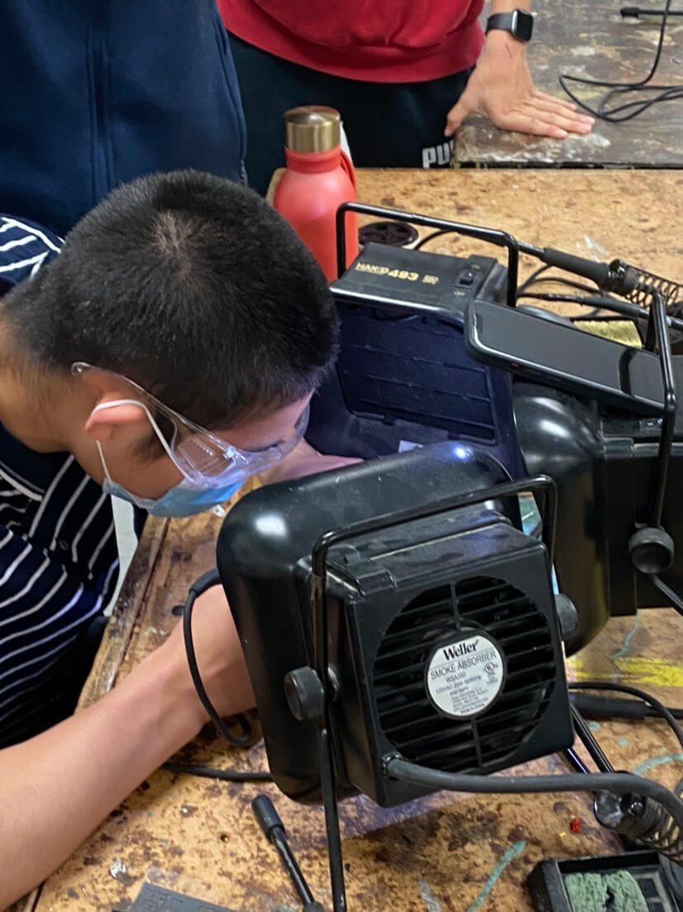
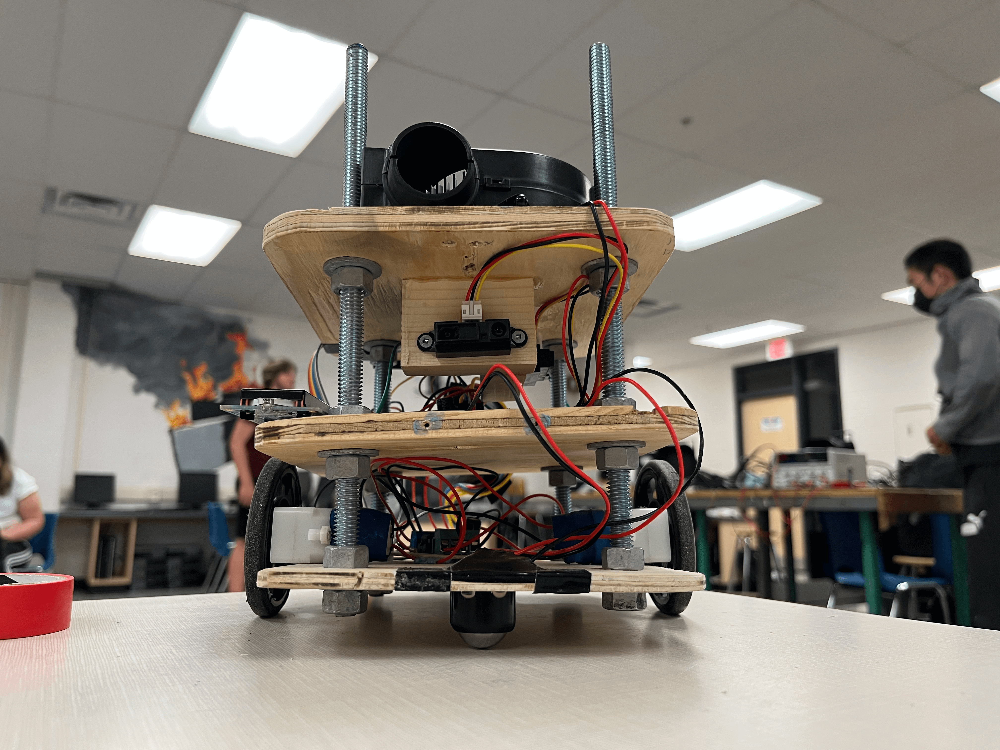
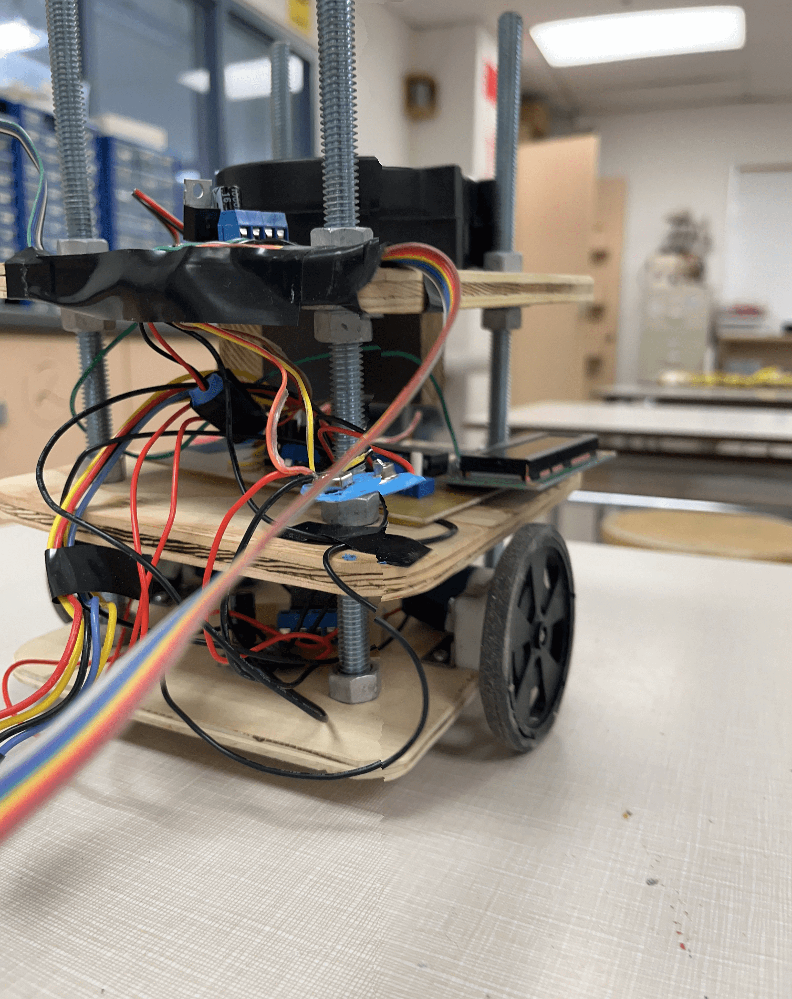

# Firefighter Bot

Robot project for TEJ 4MI (Computer Engineering Technology). You can find the proposal [here](./media/LUKEXIANG%20Proposal.pdf)

The robot completing maze 2, room 4: [https://youtu.be/kA35vJTtDxw](https://youtu.be/kA35vJTtDxw).

## Pictures

Breadboarding at the start:

Schematic for a PCB (motor board):

Xiang Soldering:

The bot:

The boards:

