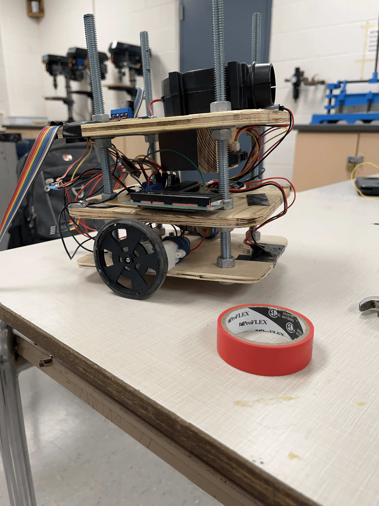

# Firefighter Bot

Robot project for TEJ 4MI (Computer Engineering Technology) by Luke Zhang and Xiang Li. You can find the proposal [here](./media/LUKEXIANG%20Proposal.pdf). We assembled the bot from rudimentary parts, and created our own PCBs which we soldered components onto.

The robot completing maze 2, room 4: [https://youtu.be/kA35vJTtDxw](https://youtu.be/kA35vJTtDxw), and the PIC code is written in [Great Cow Basic](https://gcbasic.sourceforge.net/Typesetter/index.php/Home).

## Pictures

Breadboarding at the start:

Schematic for a PCB (motor board):

Xiang Soldering:

The bot:

The boards:

